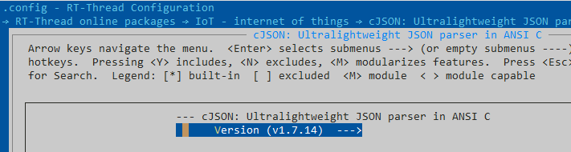
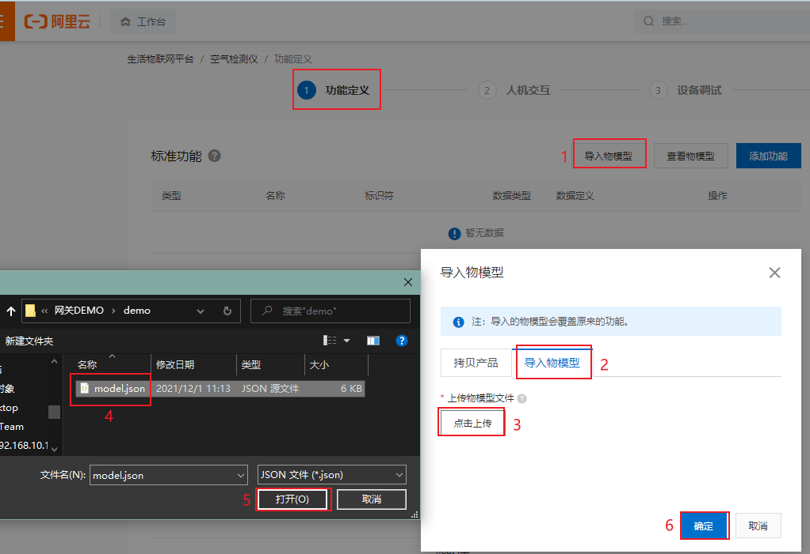
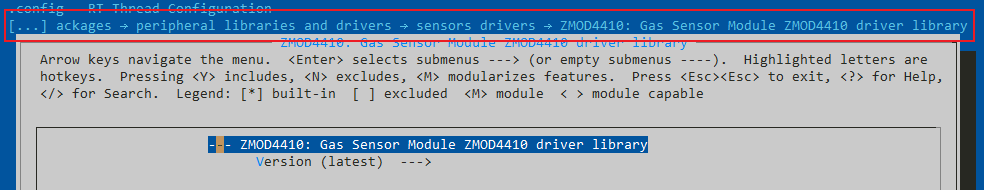
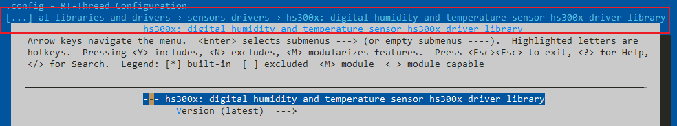
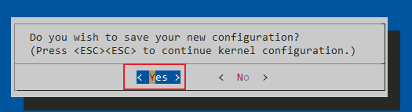
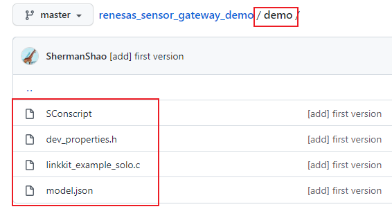
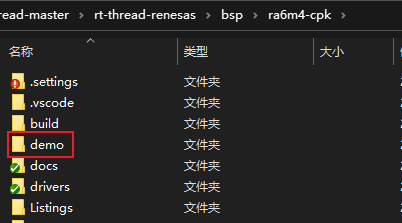

# RENESAS + RT-Thread 传感器网关 DEMO

## 简介

这是一个基于 RA6M4-CPK 开发板 + RT-Thread 实现的传感器网关 DEMO。

本文将介绍如何一步步从零搭建一个传感器网关。

下图是整体的设计框图，板载 ISL29035 光敏传感器使用 IIC 通信接口接入主控芯片，RW007 用于网络通信。在主控芯片中添加所需要的软件包、组件等中间件来快速搭建起一个传感器网关。

## 实际运行效果
1、在 msh 中输入`linkkit_demo` 命令创建并启动 demo 线程

2、在云平台的设备调试页面查看实时刷新的数据。

## 准备工作

- [RA6M4-CPK 开发板](https://www2.renesas.cn/cn/zh/products/microcontrollers-microprocessors/ra-cortex-m-mcus/cpk-ra6m4-evaluation-board)
- RT-Thread 中 RA6M4-CPK 的 BSP [Github](https://github.com/RT-Thread/rt-thread/tree/master/bsp/ra6m4-cpk) / [Gitee](https://gitee.com/rtthread/rt-thread/tree/master/bsp/ra6m4-cpk) 
- 板载传感器：[ISL29035](https://www2.renesas.cn/cn/zh/products/sensor-products/light-proximity-sensors/ambient-light-sensors/ambient-light-digital-sensors/isl29035-integrated-digital-light-sensor-interrupt)
- WiFi 网络模块：[RW007](https://github.com/RT-Thread-packages/rw007)
- 阿里云：[生活物联网平台](https://living.aliyun.com/)

## 实现过程

1、下载 rt-thread 源码和必备的开发工具，参考 `/bsp/ra6m4-cpk/` 路径下的 [README](https://github.com/RT-Thread/rt-thread/tree/master/bsp/ra6m4-cpk) 搭建好软件开发环境。编译下载初始工程，验证系统正常运行。

2、将传感器模块和网络模块连接开发板。

|       模块        | 模块引脚 | 开发板引脚 | MCU引脚编号 |
| :---------------: | :------: | :--------: | :---------: |
|     **RW007**     |    \     |     \      |      \      |
|                   |   GND    |    GND     |     --      |
|                   |   SCK    |    P412    |   0x040C    |
|                   |   MISO   |    P410    |   0x040A    |
|                   |   MOSI   |    P411    |   0x040B    |
|                   |    CS    |    P413    |   0x040D    |
|                   | D9(INT)  |    P506    |   0x0506    |
|                   | D8(RST)  |    P415    |   0x040F    |
|                   |   3V3    |    VCC     |     --      |
| **板载 ISL29035** |    \     |     \      |      \      |
|                   |   SCL    |    P512    |   0x050C    |
|                   |   SDA    |    P511    |   0x050B    |

- 开发板示意图

- 实物连接图

3、配置所需要的软件包、组件、外设驱动

- [RW007](http://packages.rt-thread.org/detail.html?package=rw007) 软件包配置：参考文档路径 `bsp/ra6m4-cpk/docs/使用瑞萨FSP配置工具.md`

- [ali-iotkit](http://packages.rt-thread.org/detail.html?package=ali-iotkit) 软件包配置：
  
- cJSON 软件包配置：更改版本号为 v1.7.14 。
  
  
  
- 
  
  - [云平台](https://living.aliyun.com/)创建项目，创建完成后点击项目进入配置
  
  
- 在新建的项目中创建产品
    

  - 配置产品功能定义
    
  
  - 进入设备调试页面选择将页面拉到最下方选择 “未认证模组”
  
  - 新增测试设备 “renesas_test”
  
  - 进入详情页查看设备三元组信息
  
  - 在 menuconfig 中开启 ali-iotkit 软件包，将新创建的产品三元组信息填入配置项中。
  > 注意：三元组信息是一机一密，所以不能有两个以上的设备使用同一组三元组信息。

- 打开 [ZMOD4410](http://packages.rt-thread.org/detail.html?package=zmod4410) 软件包

- 打开 [hs300x](http://packages.rt-thread.org/detail.html?package=hs300x) 软件包

- 保存 menuconfig 配置，输入命令更新软件包 ` pkgs --update`，输入命令生成 MDK 工程 ` scons --target=mdk5`

    

    

- 将 /demo/ 目录加入工程中

## 开源代码

整个 demo 的全部代码都会开源到 Github：[跳转链接](https://github.com/ShermanShao/renesas_sensor_gateway_demo) 

## 更多详细资料

