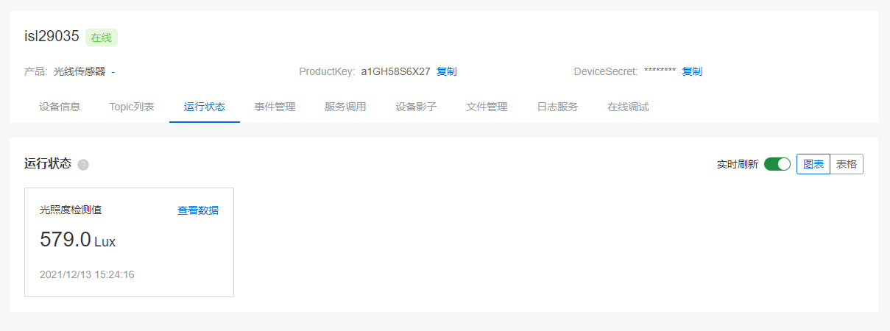
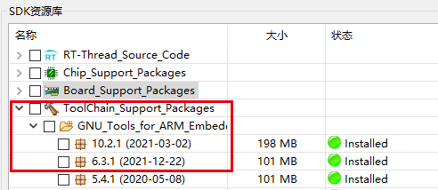
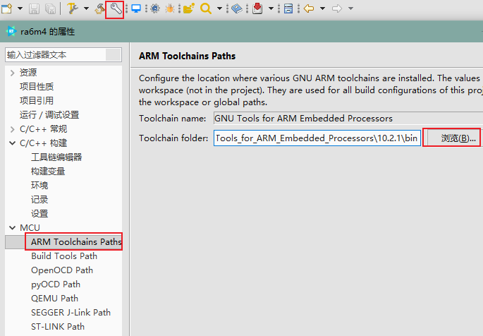
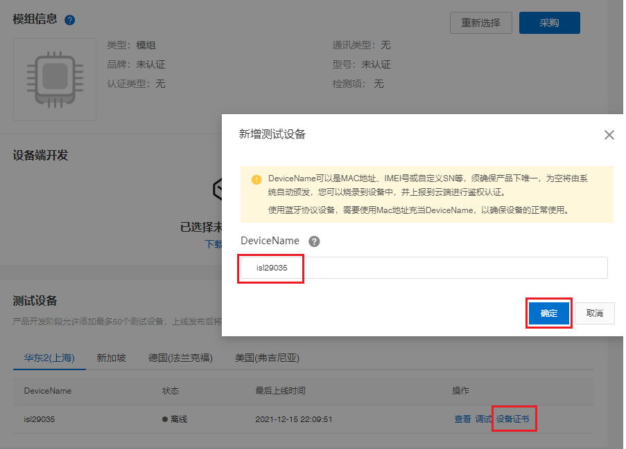

# RENESAS + RT-Thread 传感器网关 DEMO

## 简介

这是一个基于 RA6M4-CPK 开发板 + RT-Thread 实现的传感器网关 DEMO。

本文将介绍如何一步步从零搭建一个传感器网关。

下图是整体的设计框图，板载 ISL29035 光敏传感器使用 IIC 通信接口接入主控芯片，RW007 用于网络通信。在主控芯片中添加所需要的软件包、组件等中间件来快速搭建起一个传感器网关。

## 实际运行效果
1、在 msh 中输入`linkkit_demo` 命令创建并启动 demo 线程

2、在云平台的设备调试页面查看实时刷新的数据。

## 准备工作

- [RT-Thread studio v2.1.4](https://download-sh-cmcc.rt-thread.org:9151/www/studio/download/RT-Thread%20Studio-v2.1.4-setup-x86_64_20211215-1700.exe)
- Renesas 开发板支持包
  
- JLINK v7.50
  
- GNU_Tools_for_ARM_Embedded_Processors v6.3.1 或 v10.2.1，默认配置为 v10.2.1
  
- [RASC](https://github.com/renesas/fsp/releases)（可选）：版本 fsp v3.1.0、rasc v2021-04
  
- 阿里云：[生活物联网平台](https://living.aliyun.com/)
- [RA6M4-CPK 开发板](https://www2.renesas.cn/cn/zh/products/microcontrollers-microprocessors/ra-cortex-m-mcus/cpk-ra6m4-evaluation-board)
- USB-TTL：连接 UART7 （TX:P613; RX:P614）**波特率 115200**
- 板载传感器：[ISL29035](https://www2.renesas.cn/cn/zh/products/sensor-products/light-proximity-sensors/ambient-light-sensors/ambient-light-digital-sensors/isl29035-integrated-digital-light-sensor-interrupt)
- WiFi 网络模块：[RW007](https://gitee.com/RT-Thread-Mirror/rw007)

## 实现过程

1. 下载必备的开发工具，[参考文档](https://gitee.com/rtthread/rt-thread/tree/master/bsp/ra6m4-cpk) 搭建好软件开发环境。

2. 将传感器模块和网络模块连接开发板。

|       模块        | 模块引脚 | 开发板引脚 | MCU引脚编号 |
| :---------------: | :------: | :--------: | :---------: |
|     **RW007**     |    \     |     \      |      \      |
|                   |   GND    |    GND     |     --      |
|                   |   SCK    |    P412    |   0x040C    |
|                   |   MISO   |    P410    |   0x040A    |
|                   |   MOSI   |    P411    |   0x040B    |
|                   |    CS    |    P413    |   0x040D    |
|                   | D9(INT)  |    P506    |   0x0506    |
|                   | D8(RST)  |    P415    |   0x040F    |
|                   |   3V3    |    VCC     |     --      |
| **板载 ISL29035** |    \     |     \      |      \      |
|                   |   SCL    |    P512    |   0x050C    |
|                   |   SDA    |    P511    |   0x050B    |

- 开发板示意图
  

- 实物连接图
  
  
- 连接 UART7 （TX:P613; RX:P614）,**波特率 115200**。

  

3. 打开 RT-Thread studio，创建开发板示例工程

    

    

    

4. GCC 版本建议使用 v10.2.1，可以在 studio 的包管理器中下载并配置工具链路径

 > studio 中的路径：
 > \repo\Extract\ToolChain_Support_Packages\ARM\GNU_Tools_for_ARM_Embedded_Processors\10.2.1\bin

5. 配置 JLINK 路径

6. 编译、下载，验证运行结果
  - 查看系统运行情况
  >输入命令 `help`、`ps`、`free`、`list_device` 等命令查看系统运行状态

  - 验证传感器功能
  > 输入命令 `sensor_polling li_isl29` 验证是否获取到传感器的光线强度数据。

  - 验证 WiFi 功能
  > 输入 `wifi` 查看系统支持的 wifi 命令
  > 输入 `wifi scan` 扫描当前环境中的 WiFi 热点信号及信息
  > 输入 `wifi join [ssid] [passwor]` 连接热点

7. 连云配置

  - 在[云平台](https://living.aliyun.com/)创建项目，创建完成后点击项目进入配置
    

  - 在新建的项目中创建产品
      

  - 进入设备调试页面选择将页面拉到最下方选择 “未认证模组”
    

  - 新增测试设备 “renesas_test”
    

  - 查看设备三元组信息
    

  - 在 menuconfig 中开启 ali-iotkit 软件包，将新创建的产品三元组信息填入配置项中。保存配置信息，编译、下载工程。

  > 注意：三元组信息是一机一密，所以不能有两个以上的设备使用同一组三元组信息。
  > 

  - 修改代码中连接热点的 SSID 和 password，启动 demo 程序可自动连接。**注意：SSID 需要使用全小写**
    

8. 编译、下载，验证传感器网关数据上报功能。
  >注意：暂不支持在 Studio 上 DEBUG，请直接下载程序验证。(12-27)
  >
  >命令行输入 `linkkit_demo` 命令，启动网关 demo 程序。在设备详情页查看实时上报信息
  >

## 扩展内容
### 使用 RASC 配置工程

- 配置 RASC 路径

- 使用 RASC 结合 setting 配置工程，开启其他外设功能，可参考文档：[使用瑞萨FSP配置工具](https://gitee.com/rtthread/rt-thread/blob/master/bsp/ra6m4-cpk/docs)

### 如何从零开始配置传感器网关
1. 配置所需要的软件包、组件、外设驱动

- 创建 CPK-RA6M4 模板工程
- 添加 [RW007](http://packages.rt-thread.org/detail.html?package=rw007) 软件包，配置说明：[使用瑞萨FSP配置工具](https://gitee.com/rtthread/rt-thread/blob/master/bsp/ra6m4-cpk/docs) RW007 部分。
- 添加 [ali-iotkit](http://packages.rt-thread.org/detail.html?package=ali-iotkit) 软件包
- 修改 cJSON 软件包配置：版本号为 v1.7.14 。
- 添加 ISL29035 传感器软件包

2. 云平台创建产品，将设备的三元组信息配置到工程中
3. 编译、下载，验证执行结果

## 开源代码

整个 demo 的代码开源到 Github：[跳转链接](https://github.com/ShermanShao/renesas_sensor_gateway_demo)

## 更多资料

- [开发板官网主页](https://www2.renesas.cn/cn/zh/products/microcontrollers-microprocessors/ra-cortex-m-mcus/cpk-ra6m4-evaluation-board)
- [开发板用户手册](https://www2.renesas.cn/cn/zh/document/mah/1527156?language=zh&r=1527191)
- [瑞萨RA MCU 基础知识](https://www2.renesas.cn/cn/zh/document/gde/1520091)
- [RA6 MCU 快速设计指南](https://www2.renesas.cn/cn/zh/document/apn/ra6-quick-design-guide)
- [RA6M4_datasheet](https://www2.renesas.cn/cn/zh/document/dst/ra6m4-group-datasheet)
- [RA6M4 Group User’s Manual: Hardware](https://www2.renesas.cn/cn/zh/document/man/ra6m4-group-user-s-manual-hardware)
